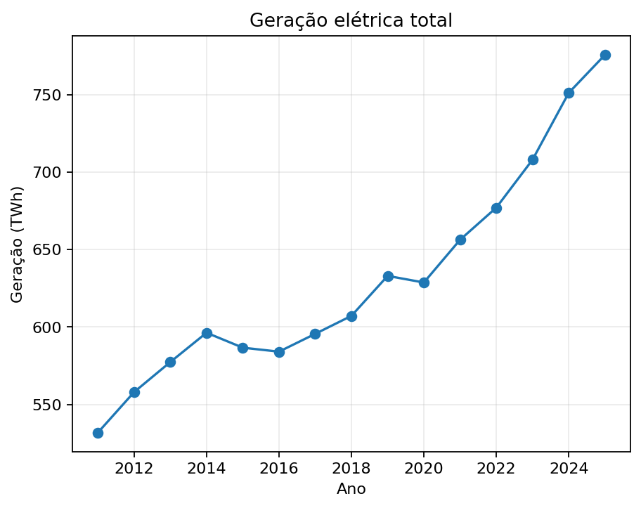
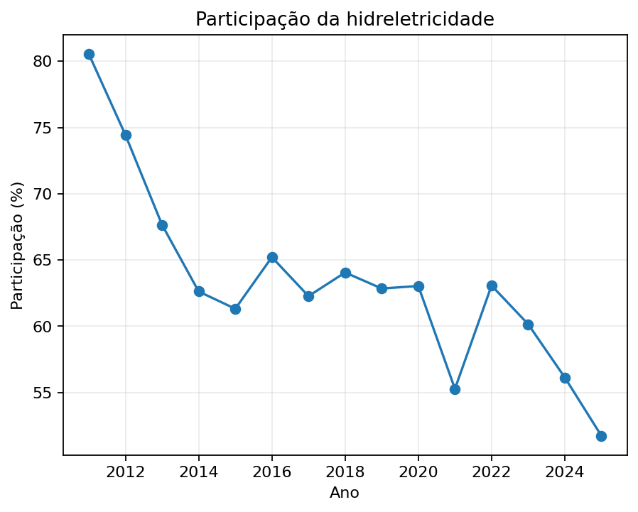
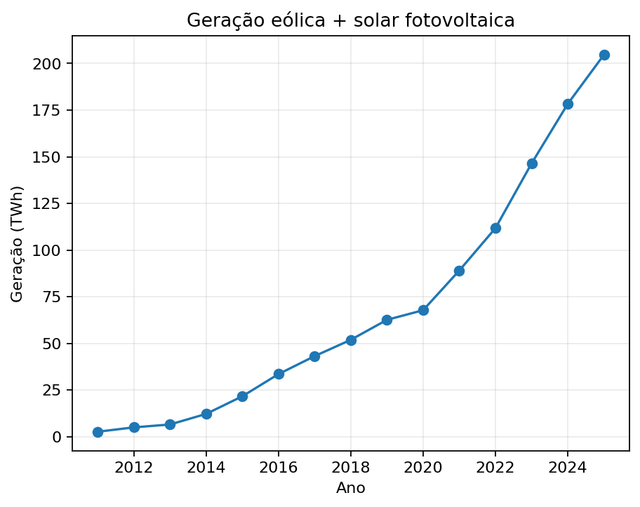
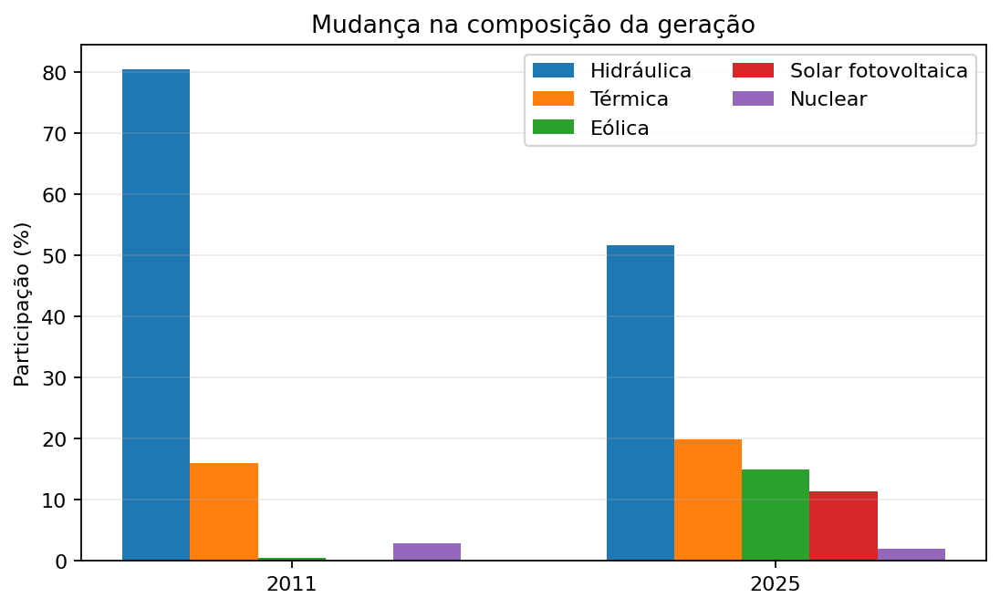

# Resumo

Este estudo analisa a transformação da matriz elétrica brasileira entre 2011 e 2025 a partir de séries históricas da Empresa de Pesquisa Energética (EPE). O objetivo é identificar como evoluíram o volume de geração e a composição das principais fontes. A geração total passou de 531,76 TWh em 2011 para 775,90 TWh em 2025, aumento de 45,9%. No mesmo intervalo, a geração hidráulica recuou de 428,33 TWh para 401,42 TWh, enquanto sua participação caiu de aproximadamente 80,5% para 51,7%. Em sentido oposto, a geração eólica alcançou 116,49 TWh e a solar fotovoltaica 88,14 TWh em 2025. Juntas, essas duas fontes representaram 26,4% da geração. Os resultados indicam que a principal transformação estrutural do período foi a redução da concentração hidráulica e a diversificação tecnológica da geração, sem que as hidrelétricas deixassem de ocupar posição central.

**Palavras-chave:** matriz elétrica; geração de eletricidade; hidreletricidade; energia eólica; energia solar; Brasil.

# 1. Introdução

A matriz elétrica brasileira possui uma característica histórica singular: a elevada participação de fontes renováveis, especialmente da geração hidrelétrica. Essa característica permanece relevante, mas a composição da geração mudou de maneira significativa durante a última década e meia.

A questão central deste estudo é: **como a composição da geração elétrica brasileira se transformou entre 2011 e 2025?** A hipótese é que a mudança mais importante não corresponde a uma simples substituição da hidreletricidade, mas a uma redução de sua concentração relativa acompanhada pela expansão de novas fontes, sobretudo eólica e solar.

No BEN 2026, ano-base 2025, a EPE reporta 86,8% de renovabilidade da matriz elétrica brasileira e participação conjunta de 26,4% para eólica e solar fotovoltaica.

# 2. Dados e metodologia

A análise utiliza as séries históricas do Balanço Energético Nacional (BEN), disponibilizadas pela EPE, complementadas pelos dados estaduais e pela série histórica de capacidade instalada. O período principal é 2011–2025.

Para tornar a série nacional internamente consistente, a geração total anual foi tomada da linha **PRODUÇÃO** da tabela de eletricidade do BEN. As gerações hidráulica, eólica, solar fotovoltaica e nuclear foram agregadas a partir dos dados estaduais. A geração térmica foi obtida como o residual entre a geração total oficial e as quatro categorias anteriores. Essa estratégia evita a ausência de registros térmicos estaduais em alguns anos iniciais e garante reconciliação com o total oficial.

A participação de cada fonte foi calculada por

$$s_{i,t}=\frac{G_{i,t}}{G_t}\times100.$$

Não foram utilizadas taxas de crescimento sobre bases iniciais próximas de zero como principal indicador para a solar. A análise privilegia volume absoluto e participação na matriz.

# 3. Resultados

## 3.1 Crescimento da geração total

A geração elétrica aumentou de 531,76 TWh em 2011 para 775,90 TWh em 2025, acréscimo de aproximadamente 244,14 TWh ou 45,9%. O crescimento do sistema ocorreu simultaneamente à mudança da composição das fontes.

## 3.2 Hidreletricidade

A geração hidráulica caiu aproximadamente 6,3% entre 2011 e 2025, de 428,33 TWh para 401,42 TWh. Sua participação, entretanto, caiu muito mais: de aproximadamente 80,5% para 51,7%. Isso mostra que a fonte não foi simplesmente substituída; outras tecnologias cresceram sobre um sistema cuja base hidráulica permaneceu em patamar elevado.

## 3.3 Expansão eólica e solar

A geração eólica passou de 2,70 TWh em 2011 para 116,49 TWh em 2025. A solar fotovoltaica passou de praticamente zero para 88,14 TWh. Juntas, eólica e solar alcançaram 204,63 TWh em 2025, correspondendo a 26,4% da geração.

Esse resultado representa a mudança tecnológica mais expressiva do período. Fontes que eram marginais passaram a constituir um dos principais blocos de geração do sistema.

## 3.4 Mudança da composição

A comparação entre 2011 e 2025 mostra a redução da concentração hidráulica e a ascensão das fontes eólica e solar.

A mudança não deve ser descrita como simples passagem de uma matriz não renovável para uma renovável. O sistema brasileiro já apresentava elevada renovabilidade no início do período. O fenômeno observado é a diversificação interna de uma matriz predominantemente renovável.

## 3.5 Térmica e nuclear

A geração térmica permaneceu relevante e deve ser interpretada como uma categoria agregada de diferentes combustíveis e tecnologias. A geração nuclear apresentou comportamento relativamente estável, em torno de 15–16 TWh anuais, enquanto sua participação relativa diminuiu diante do crescimento mais rápido da geração total.

# 4. Discussão

Os resultados apontam para três características fundamentais. Primeiro, a matriz continuou predominantemente renovável. Segundo, a hidreletricidade perdeu concentração relativa, mas permaneceu como principal fonte individual. Terceiro, eólica e solar passaram de fontes marginais para componentes estruturais do sistema.

A formulação mais precisa da transformação é, portanto: **o Brasil não deixou de depender da hidreletricidade; passou a depender menos exclusivamente dela.**

Essa diversificação também altera a geografia da geração, especialmente pela expansão eólica e solar e pela geração distribuída. Contudo, a avaliação de efeitos sobre despacho, confiabilidade, transmissão, armazenamento, preços ou segurança energética requer variáveis adicionais e não é objetivo deste estudo.

# 5. Conclusão

Entre 2011 e 2025, a matriz elétrica brasileira passou por uma transformação marcada pela diversificação da geração. A produção total cresceu 45,9%, enquanto a participação hidráulica caiu de aproximadamente 80,5% para 51,7%. Paralelamente, eólica e solar alcançaram conjuntamente 26,4% da geração.

A principal conclusão é que o Brasil não abandonou sua base renovável nem sua dependência da hidreletricidade. O que ocorreu foi uma redução da concentração em uma única tecnologia e a incorporação, em escala significativa, de novas fontes. Em 2025, a EPE registrou 86,8% de renovabilidade da matriz elétrica, reforçando que a transformação ocorreu dentro de uma estrutura ainda predominantemente renovável.

# 6. Limitações

A análise é predominantemente descritiva e não estima relações causais. Não são modelados despacho, confiabilidade, transmissão, armazenamento, preços ou capacidade de reserva. Geração e capacidade instalada também não são intercambiáveis: diferentes tecnologias possuem diferentes padrões de utilização.

# 7. Referências

EMPRESA DE PESQUISA ENERGÉTICA — EPE. *Balanço Energético Nacional 2026: Relatório Síntese — ano base 2025*. Rio de Janeiro: EPE, 2026.

EMPRESA DE PESQUISA ENERGÉTICA — EPE. *BEN — Séries Históricas e Matrizes*. Rio de Janeiro: EPE.

EMPRESA DE PESQUISA ENERGÉTICA — EPE. *Anuário Estatístico de Energia Elétrica 2026 — ano base 2025*. Rio de Janeiro: EPE, 2026.
